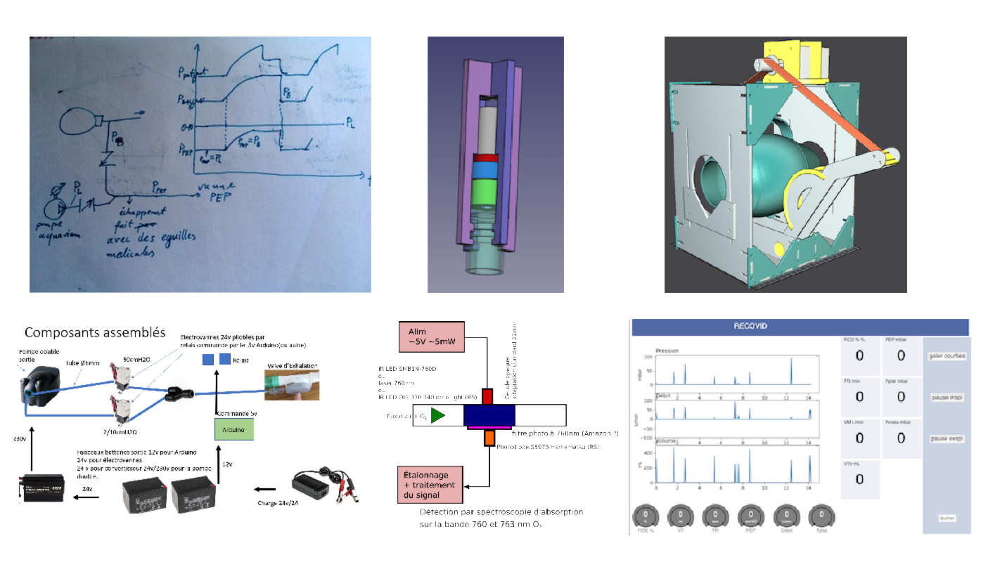

# Notre objectif ? fgfghf

Recovid est un **collectif de citoyens** rassemblant des acteurs de différents milieux économiques et académiques Auvergne Rhône Alpes dans le but de **fabriquer une assistance respiratoire contrôlée non conventionnelle.**

Avec le pic épidémique, les hôpitaux risquent de manquer de respirateurs (machines de Ventilation Assistée Controlée).

L’idée est de partir des respirateurs manuels et de produire une solution pour les mécaniser avec un bras mécanique et de l’électronique.

    
    <video src="video/ambubag-1.mp4" width="330" height="330" align="center" controls preload></video>

* Nous souhaitons proposer une **solution open-source & open hardware** pour fabriquer des machines de VAC d’urgence.

* En donnant les codes sources et les schémas aux fablabs et Maker de France, nous serions en capacité de refaire d'autres pièces et équipements.

**Le service de réanimation du CHU Grenoble nous aide à valider le prototype, et, une entreprise de la région Auvergne-Rhones-Alpes contribue au projet en concevant une version certifié et produire une première série pour le CHU.**

# Recovid Spécifications Cliniques

Recovid se différencie ([par rapport aux autres équipements existants](https://docs.google.com/spreadsheets/d/e/2PACX-1vTYAfldxoIiO46VAWH1NlhrwFBn9mguqS2bh1spnLEu4AVVN1cj1vaEm6vOp5Z6UnaAbUwd8dslCXdM/pubhtml#)) par les éléments suivants :

- Circuit patient n’utilisant que des composants certifiés CE médical,
- Dossier réglementaire complet (ramené au contexte de développement),
- Bien adapté au traitement COVID et complet (ex : courbes temps réel sur un écran),
- Économique, robuste et simple à assembler avec des moyens industriels réduits,
- Pas de vocation commerciale : après la crise, les respirateurs sont retirés du service,
- Les livrables sont publiés sous licence libre.

# Open Source Design

> Une communauté et l'Open source comme accélérateur technologique

L'Open source et l'Open Hardware permet de faciliter l'accès et la fabrication des composants utiles pour fabriquer des respirateurs.  En donnant les codes sources et les schémas aux fablabs et Maker de France, nous serions en capacité de refaire une centaine de pièces.

De même, les licences choisies (MIT et CC) permettent à une entreprise de la région Auvergne-Rhones-Alpes de nous aider en concevant une version certifié (V2) et produire une première série.

    
    <video src="video/RECOVID-BOX.mov" width="330" height="330" align="center" controls preload></video>

# Key Research Question

* What problem are you trying to solve?
* What technologies are you using?
* What challenges have you faced and how did you overcome them?
* What is the potential impact of the technology?

Praesent ac adipiscing ullamcorper semper ut amet ac risus. Lorem sapien ut odio odio nunc. Ac adipiscing nibh porttitor erat risus justo adipiscing adipiscing amet placerat accumsan. Vis. Faucibus odio magna tempus adipiscing a non. In mi primis arcu ut non accumsan vivamus ac blandit adipiscing adipiscing arcu metus praesent turpis eu ac lacinia nunc ac commodo gravida adipiscing eget accumsan ac nunc adipiscing adipiscing lorem ipsum dolor sit amet nullam veroeros adipiscing.

